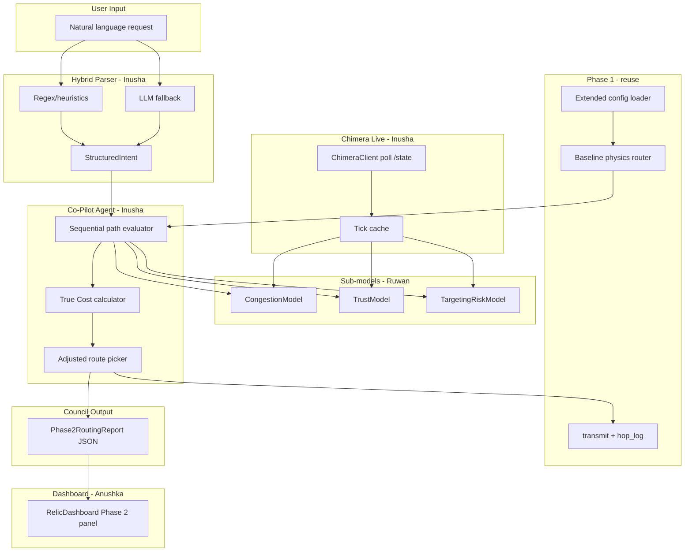

# Phase 2: Chimera Co-Pilot — Implementation Plan

## Context

**Phase 1 (done):** Physics-based routing ([`src/lib/relic/router.ts`](src/lib/relic/router.ts)), transmission + `hop_log` ([`src/lib/relic/transmission.ts`](src/lib/relic/transmission.ts)), REST API, telemetry dashboard at `/relic`, 96 tests, production deploy.

**Phase 2 (new):** Chimera sabotages **interplanetary links only** — congestion, spoofed telemetry, predictable-route targeting. You must **not** replace the baseline router; add an **Analytical Co-Pilot** that scores links and overrides routing using a **True Cost** model. Output must match the **exact** Council JSON schema.

**Intelligence package (already in repo):**

- [`challenge/universe-config.json`](challenge/universe-config.json) — adds `interplanetary_links[]` with `capacity_units`
- [`challenge/link_traffic_history.csv`](challenge/link_traffic_history.csv) — congestion model training
- [`challenge/link_telemetry.csv`](challenge/link_telemetry.csv) — trust model training
- [`challenge/link_incident_history.csv`](challenge/link_incident_history.csv) — targeting-risk model training
- [`challenge/DATASETS.md`](challenge/DATASETS.md) — column reference

**Live service:** `https://chimera.launch26.space` — `GET /links`, `GET /state` (requires `X-Team-Key`). **Do not train on `/state` during Days 1–3** (scrambled); train only on CSVs.

### Stack Kings — Chimera API credentials

| Setting      | Value                                            |
| ------------ | ------------------------------------------------ |
| **Base URL** | `https://chimera.launch26.space`                 |
| **Team**     | Stack Kings                                      |
| **API key**  | `your-team-key-here` (set in `CHIMERA_TEAM_KEY`) |
| **Header**   | `X-Team-Key: <your-team-key>`                    |

**Usage rules (mandatory):**

- All Chimera requests (`GET /links`, `GET /state`) must send this key in the `X-Team-Key` header.
- Store the key in **environment variables only** — never hardcode in source files or commit to GitHub.
- Local dev: set `CHIMERA_TEAM_KEY=your-team-key-here` in `.env` (gitignored).
- Vercel: add `CHIMERA_TEAM_KEY` under Project → Settings → Environment Variables (Production + Preview).
- Do **not** share this key with other teams or embed it in client-side browser code; server-side `ChimeraClient` only.

**Example request:**

```http
GET /state HTTP/1.1
Host: chimera.launch26.space
X-Team-Key: <your-team-key>
```

**Owner:** Inusha wires this into [`src/lib/chimera/client.ts`](src/lib/chimera/client.ts) via `process.env.CHIMERA_TEAM_KEY`. Ruwan uses the same `.env` for manual smoke tests during model development.

---

## Team roles (3 members)

| Member           | Primary ownership                                                                                                                                          | Secondary                                                 |
| ---------------- | ---------------------------------------------------------------------------------------------------------------------------------------------------------- | --------------------------------------------------------- |
| **Inusha (you)** | Co-Pilot agent orchestration, True Cost router, Chimera API client, NL hybrid parser, unified report schema, new API routes, integration tests             | Architecture, demo decision-audit talking points          |
| **Anushka**      | Dashboard Phase 2 UI: NL input, `link_evaluations` panel, map overlays, explanation display, intelligence-walkthrough views                                | E2E Playwright for Phase 2 flows                          |
| **Ruwan**        | CSV ingestion, feature engineering, three analytical sub-models (congestion / trust / targeting), offline model evaluation, extended config parser support | Chimera client smoke tests, README model findings section |

**Integration rule:** Ruwan exposes **pure functions** (`predictCongestion`, `scoreTrust`, `scoreTargetingRisk`). Inusha wires them as **agent tools**. Anushka consumes the **report JSON** only — no direct model calls from UI.

---

## Target architecture



---

## Phase 0 — Foundation (Day 1, all hands, ~4–6 hours)

**Goal:** Shared types, config extension, link ID conventions, env setup.

### 0.1 Extend domain types

**Owner: Inusha** · **Support: Ruwan**

Add to [`src/lib/relic/types.ts`](src/lib/relic/types.ts):

```ts
interface InterplanetaryLink {
  link_id: string; // alphabetical: "Aegis-Boreas"
  planet_a: string;
  planet_b: string;
  capacity_units: number;
}

interface ChimeraLinkState {
  link_id: string;
  planet_a: string;
  planet_b: string;
  capacity_units: number;
  current_load: number;
  load_ratio: number;
  self_reported_latency_ms: number | null;
  traffic_share: number;
  status: "ok" | "saturated";
}

interface LinkEvaluation {
  link_id: string;
  predicted_congestion_penalty_ms: number;
  trust_score: number; // 0–1, higher = more trustworthy
  targeting_risk_score: number; // 0–1, higher = more likely jammed
  combined_cost: number;
}

interface Phase2RoutingReport {
  origin_id: string;
  destination_id: string;
  chosen_path: string[];
  link_evaluations: LinkEvaluation[];
  final_latency_estimate_ms: number;
  explanation: string;
}
```

Add helper `canonicalLinkId(a, b)` in new [`src/lib/chimera/link-id.ts`](src/lib/chimera/link-id.ts) — must match [`edgeKey`](src/lib/relic/graph.ts) alphabetical convention.

### 0.2 Extend config parser

**Owner: Ruwan** · **Review: Inusha**

Update [`src/lib/relic/config.ts`](src/lib/relic/config.ts) to parse optional `interplanetary_links` from [`challenge/universe-config.json`](challenge/universe-config.json):

- Validate `link_id === canonicalLinkId(planet_a, planet_b)`
- Cross-check links exist in physics graph (`within_lmax` edges)
- Add `UNIVERSE_CONFIG_PATH` default switch to `challenge/universe-config.json` for Phase 2 dev (document in [`.env.example`](.env.example))

### 0.3 Environment & secrets

**Owner: Inusha**

Add to [`.env.example`](.env.example) (placeholder only — **no real key in repo**):

```
CHIMERA_API_BASE_URL=https://chimera.launch26.space
CHIMERA_TEAM_KEY=your-team-key-here
```

**Stack Kings key (local `.env` only, not committed):**

```
CHIMERA_TEAM_KEY=your-team-key-here
```

Also add to Vercel env vars for deployed `/api/route` polling. Optional LLM fallback:

```
AI_GATEWAY_API_KEY=
```

### 0.4 New module scaffold

**Owner: Inusha**

```
src/lib/chimera/
  link-id.ts
  types.ts              # re-export or mirror report types
  client.ts             # Chimera API HTTP client
  csv/                  # Ruwan: loaders
  models/               # Ruwan: congestion, trust, targeting
  parser/               # Inusha: hybrid NL parser
  agent/                # Inusha: co-pilot orchestrator
  router/               # Inusha: true-cost routing
```

**Deliverable:** `npm test` still green; config loads Phase 2 universe with 12 links.

---

## Phase 1 — Data & analytical sub-models (Days 1–2, Ruwan-led)

**Goal:** Three trained models that map live `/state` fields + history features → scores. **Train only on CSVs.**

### 1.1 CSV loaders

**Owner: Ruwan**

New files:

- [`src/lib/chimera/csv/load-traffic.ts`](src/lib/chimera/csv/load-traffic.ts)
- [`src/lib/chimera/csv/load-telemetry.ts`](src/lib/chimera/csv/load-telemetry.ts)
- [`src/lib/chimera/csv/load-incidents.ts`](src/lib/chimera/csv/load-incidents.ts)

Handle nulls/empty cells (saturated links, missing `load_units`). Group by `link_id` + `tick`.

### 1.2 Congestion model (`predictCongestion`)

**Owner: Ruwan**

**Training data:** `link_traffic_history.csv` — features: `load_ratio`, `load_units`, `status`, lagged load; target: `observed_latency_ms` penalty over baseline physics void latency OR binary `status === "saturated"`.

**Approach (start simple, iterate):**

1. **v1:** Piecewise lookup / regression — fit `penalty_ms = f(load_ratio)` per link + global fallback
2. **v2:** Logistic threshold for `slow → saturated` transition (PDF: learn when link goes from slow to hard failure)
3. Export coefficients to JSON in [`src/lib/chimera/models/congestion.model.json`](src/lib/chimera/models/congestion.model.json) for runtime use without Python dependency

**Runtime API:**

```ts
predictCongestion(linkState: ChimeraLinkState, physicsVoidMs: number): {
  penalty_ms: number;
  is_saturated: boolean;
}
```

- If `status === "saturated"` or `self_reported_latency_ms === null` → **hard unavailable** (like Phase 1 `blockedEdges`)

### 1.3 Trust model (`scoreTrust`)

**Owner: Ruwan**

**Training data:** `link_telemetry.csv` — compare `self_reported_latency_ms` vs `measured_latency_ms`.

**Approach:**

- Compute per-link historical delta distribution
- Flag systematic under-reporting (Chimera spoofing) vs honest noise
- Output `trust_score` 0–1 (high = believe self-report)

**Runtime:** Uses live `self_reported_latency_ms` vs expected honest range from model. Links with chronic spoofing pattern → low trust → inflate `combined_cost`.

### 1.4 Targeting-risk model (`scoreTargetingRisk`)

**Owner: Ruwan**

**Training data:** `link_incident_history.csv` — features: `traffic_share`, rolling share, path popularity proxies; target: `jammed_flag`.

**Approach:**

- Classifier: P(jammed | traffic_share, recent_share, link_id prior)
- Supports PDF directive: **route entropy** — penalize paths that reuse high-share links

**Runtime:** Uses live `traffic_share` from `/state`.

### 1.5 Offline evaluation notebook/script

**Owner: Ruwan**

Add [`scripts/evaluate-models.ts`](scripts/evaluate-models.ts) (or Python notebook in `challenge/`) reporting:

- Congestion MAE on held-out ticks
- Trust precision/recall for spoofed links (define spoofed as large systematic delta)
- Targeting AUC for `jammed_flag`

Document findings in [`challenge/INTELLIGENCE_REPORT.md`](challenge/INTELLIGENCE_REPORT.md) — **required for Evaluation Trial "Intelligence Walkthrough"**.

**Deliverable:** Unit tests per model in `src/lib/chimera/models/*.test.ts`; Ruwan presents top 3 spoofed links + congestion threshold findings.

---

## Phase 2 — Chimera live client & True Cost router (Days 2–3, Inusha-led)

### 2.1 Chimera API client

**Owner: Inusha** · **Test: Ruwan**

[`src/lib/chimera/client.ts`](src/lib/chimera/client.ts):

- `getLinks()` → `GET /links` (no key required)
- `getState()` → `GET /state` with header `X-Team-Key: ${process.env.CHIMERA_TEAM_KEY}`
- Read base URL from `CHIMERA_API_BASE_URL` (default `https://chimera.launch26.space`)
- Tick-aware cache (poll interval ~1–2s; don't spam)
- Handle 401, malformed responses, `saturated` + null latency

Integration test with mocked responses (never call live API in CI).

### 2.2 True Cost formula

**Owner: Inusha** · **Inputs from: Ruwan's models**

For each candidate void hop / link:

```
combined_cost = physics_void_ms
              + predicted_congestion_penalty_ms
              + trust_penalty_ms       // (1 - trust_score) * scale
              + targeting_penalty_ms   // targeting_risk_score * scale
              + entropy_bonus_ms       // optional: reward less popular links
```

If `is_saturated` or `trust_score` below floor → treat link as **blocked** for this tick.

### 2.3 True-cost router

**Owner: Inusha**

New [`src/lib/chimera/router/true-cost-router.ts`](src/lib/chimera/router/true-cost-router.ts):

- Wraps existing [`findShortestRoute`](src/lib/relic/router.ts) but accepts **per-edge dynamic weights** from True Cost
- Algorithm: Dijkstra with same `(planet, entryTower)` state space — only change edge weight function
- **Route diversification:** when multiple paths within ε of optimal, prefer lower aggregate `targeting_risk_score` (entropy)

Keep [`src/lib/relic/router.ts`](src/lib/relic/router.ts) unchanged as `findBaselineRoute()` export.

### 2.4 Sequential Co-Pilot agent

**Owner: Inusha**

[`src/lib/chimera/agent/copilot.ts`](src/lib/chimera/agent/copilot.ts):

**Required flow (per PDF):**

1. Parse NL request → `{ origin_id, destination_id, payload }`
2. Generate baseline physics path
3. **For each hop in path (sequential loop):**
   - Fetch current link state from cache
   - Tool call: `congestionTool(link)` → penalty
   - Tool call: `trustTool(link)` → score
   - Tool call: `targetingTool(link)` → score
   - Compute `combined_cost`; if unsafe → **re-route** from current node to destination with updated blocked set
4. Build `link_evaluations[]` for **every link on final chosen path**
5. Compute `final_latency_estimate_ms` = physics + sum(penalties)
6. Generate `explanation` string (template + key factors)

Implement tools as plain functions (not necessarily LLM tools internally) but structure matches "agent tool calls" for demo narrative.

### 2.5 Hybrid NL parser

**Owner: Inusha**

[`src/lib/chimera/parser/hybrid.ts`](src/lib/chimera/parser/hybrid.ts):

**Rules layer (fast path):**

- Regex for `"from X to Y"` / `"X -> Y"` / planet names from universe node list
- Quoted payload extraction: `"message"` or `payload: ...`
- Fuzzy match planet names (Levenshtein) against config nodes

**LLM fallback (ambiguous input):**

- Use Vercel AI SDK (`generateObject` with Zod schema) only when rules fail confidence threshold
- Schema: `{ origin_id, destination_id, payload, confidence }`

Tests with ~20 example utterances in [`src/lib/chimera/parser/hybrid.test.ts`](src/lib/chimera/parser/hybrid.test.ts).

**Deliverable:** `routeWithCopilot(nlRequest)` returns valid `Phase2RoutingReport` + runs `transmit()` on final path for `hop_log` demo.

---

## Phase 3 — API & transmission integration (Day 3, Inusha)

### 3.1 New API route

**Owner: Inusha**

[`src/app/api/route/route.ts`](src/app/api/route/route.ts) — `POST`:

```json
{ "request": "Send Hello world from Caelum to Aegis" }
```

Response: **exact** `Phase2RoutingReport` schema (disqualification if fields missing).

Optional structured mode for testing:

```json
{ "origin_id": "...", "destination_id": "...", "payload": "..." }
```

Wire through [`handleApiRoute`](src/lib/api/route-handler.ts), rate limiting, validation.

### 3.2 Extend transmit (optional)

**Owner: Inusha**

Either:

- **A)** Keep `/api/transmit` for Phase 1 demo; `/api/route` for Phase 2 scoring, or
- **B)** Add optional `use_copilot: true` flag to transmit that attaches `Phase2RoutingReport` alongside existing response

Recommend **A** for cleaner judging.

### 3.3 Health endpoint extension

**Owner: Ruwan**

Extend [`src/app/api/health/route.ts`](src/app/api/health/route.ts):

- `chimera_reachable: boolean`
- `models_loaded: boolean`
- `last_tick: number | null`

**Deliverable:** [`src/app/api/api.integration.test.ts`](src/app/api/api.integration.test.ts) extended with Phase 2 route cases.

---

## Phase 4 — Dashboard & demo UI (Days 2–4, Anushka-led)

### 4.1 NL input panel

**Owner: Anushka**

Update [`src/components/telemetry/RelicDashboard.tsx`](src/components/telemetry/RelicDashboard.tsx):

- Text area: "Send message from Aegis to Caelum: Hello world"
- Submit → `POST /api/route`
- Show structured parse result (origin/dest/payload) before routing

### 4.2 Link evaluations table

**Owner: Anushka**

New [`src/components/telemetry/LinkEvaluationsPanel.tsx`](src/components/telemetry/LinkEvaluationsPanel.tsx):

- Renders `link_evaluations[]` exactly as Council schema
- Highlight worst trust / highest targeting risk
- **Decision audit mode:** click a row → expand scoring breakdown (for live Q&A practice)

### 4.3 Map overlays

**Owner: Anushka**

Update [`src/components/telemetry/SpaceMap.tsx`](src/components/telemetry/SpaceMap.tsx):

- Color void links by `trust_score` (green → red)
- Dashed = saturated / blocked
- Pulsing = high targeting risk
- Show `chosen_path` vs baseline path toggle

### 4.4 Explanation & intelligence views

**Owner: Anushka**

- Prominent `explanation` text from report
- New [`src/components/telemetry/IntelligenceSummary.tsx`](src/components/telemetry/IntelligenceSummary.tsx) — static content from Ruwan's `INTELLIGENCE_REPORT.md` (top spoofed links, congestion thresholds)

### 4.5 E2E tests

**Owner: Anushka** · **Support: Inusha**

Extend [`e2e/relic.spec.ts`](e2e/relic.spec.ts):

- NL request → evaluations panel visible
- Chaos scenario still works with copilot routing

**Deliverable:** `/relic` demo covers all 5 evaluation trials visually.

---

## Phase 5 — Live day hardening (Final prep, all hands)

### 5.1 Live chaos pivot

**Owner: Inusha** · **UI: Anushka**

When a link in `chosen_path` becomes saturated mid-session:

- Co-Pilot re-polls `/state`, re-runs sequential evaluation, picks detour
- Dashboard animates path change without page reload
- **Zero packet loss:** transmission uses new path before send

Simulate locally by mocking saturated status on busiest link.

### 5.2 Unseen vector handling

**Owner: Inusha** · **Copy: Anushka**

When models encounter out-of-distribution `/state`:

- Never crash; set conservative scores (low trust, high risk)
- `explanation` includes uncertainty flag: `"Anomaly detected on link X; routing conservatively"`

### 5.3 Decision audit cheat sheet

**Owner: All**

One-page [`challenge/DECISION_AUDIT.md`](challenge/DECISION_AUDIT.md) — for each score field, plain-English formula judges can hear without reading code.

### 5.4 Demo script update

**Owner: Anushka**

Update [`DEMO_SCRIPT.md`](DEMO_SCRIPT.md) with Phase 2 trial flow:

1. System init (extended config + models)
2. Intelligence walkthrough (3 findings)
3. Live NL route + map
4. Chaos severance pivot
5. Decision audit drill

---

## What to reuse vs build new

| Reuse as-is                                                    | Extend                                                              | Build new                         |
| -------------------------------------------------------------- | ------------------------------------------------------------------- | --------------------------------- |
| [`router.ts`](src/lib/relic/router.ts) physics                 | [`config.ts`](src/lib/relic/config.ts) + types                      | `src/lib/chimera/*` entire module |
| [`transmission.ts`](src/lib/relic/transmission.ts)             | [`RelicDashboard.tsx`](src/components/telemetry/RelicDashboard.tsx) | True-cost router                  |
| [`graph.ts`](src/lib/relic/graph.ts) `edgeKey`                 | [`SpaceMap.tsx`](src/components/telemetry/SpaceMap.tsx)             | Chimera client                    |
| API shell ([`route-handler.ts`](src/lib/api/route-handler.ts)) | health endpoint                                                     | `/api/route`                      |
| CI / E2E harness                                               | `.env.example`                                                      | 3 ML models + CSV loaders         |
| Dashboard components                                           | DEMO_SCRIPT                                                         | Hybrid NL parser                  |

---

## Suggested timeline (competition schedule)

| Day       | Inusha                                                  | Ruwan                                        | Anushka                               |
| --------- | ------------------------------------------------------- | -------------------------------------------- | ------------------------------------- |
| **Day 1** | Types, scaffold, Chimera client stub, parser rules      | CSV loaders, config extension, congestion v1 | UI wireframes, evaluations table mock |
| **Day 2** | True-cost router, agent loop, `/api/route`              | Trust + targeting models, eval script        | NL input, map overlays                |
| **Day 3** | LLM fallback, re-route on saturation, integration tests | Model tuning, INTELLIGENCE_REPORT            | E2E, explanation panel, demo script   |
| **Final** | Live API, chaos pivot, decision audit prep              | Monitor model accuracy live                  | Lead demo presentation                |

---

## Risk register

| Risk                                | Mitigation                                                          |
| ----------------------------------- | ------------------------------------------------------------------- |
| Training on scrambled `/state`      | Ruwan: CSV only; client tests use fixtures                          |
| Schema disqualification             | Strict Zod validator on output; integration test asserts all fields |
| Saturated link treated as latency 0 | Explicit guard in congestion model + router blocklist               |
| Over-fitting to history             | Hold-out tick windows; per-link + global model fallbacks            |
| LLM latency/cost on demo            | Rules handle 80%+ cases; LLM only on fallback                       |
| Phase 1 regression                  | Keep `/api/transmit` + existing tests untouched                     |

---

## Definition of done

- [ ] Extended config loads 12 links with capacities
- [ ] Three models trained on CSVs with documented accuracy
- [ ] `POST /api/route` returns **exact** Council JSON schema
- [ ] Sequential agent evaluates each hop with three sub-model scores
- [ ] Hybrid NL parser extracts origin/destination/payload
- [ ] Live Chimera `/state` integrated with team key
- [ ] Dashboard shows evaluations, explanation, map overlays
- [ ] Chaos re-route works when busiest link saturates
- [ ] Intelligence walkthrough doc + decision audit cheat sheet ready
- [ ] All existing 96 tests + new Phase 2 tests pass in CI
